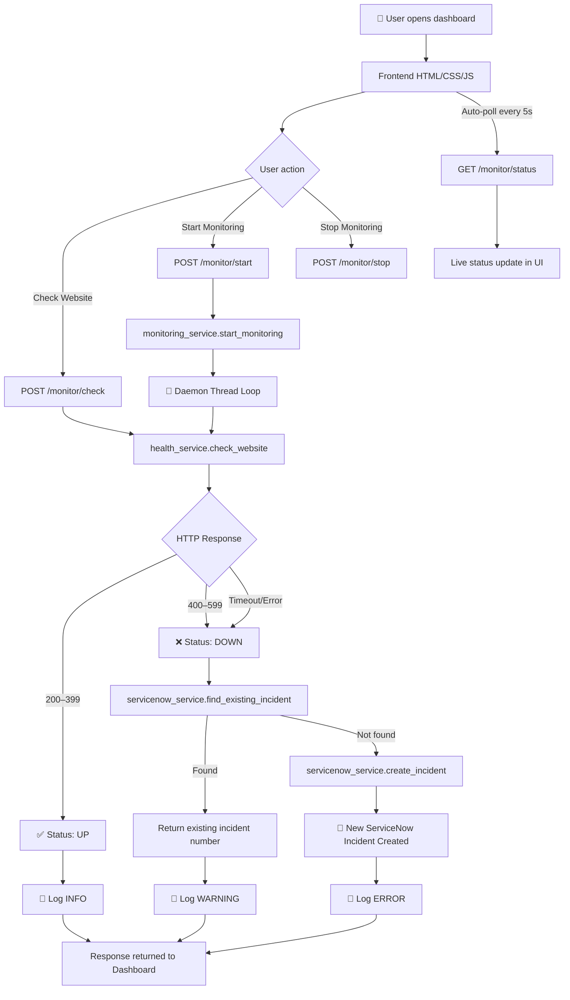
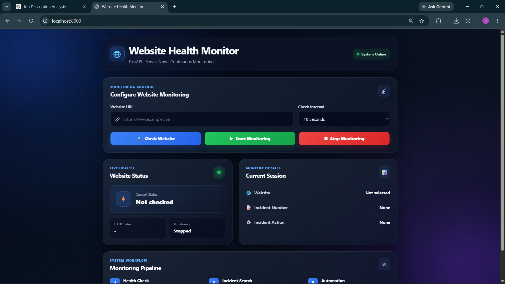
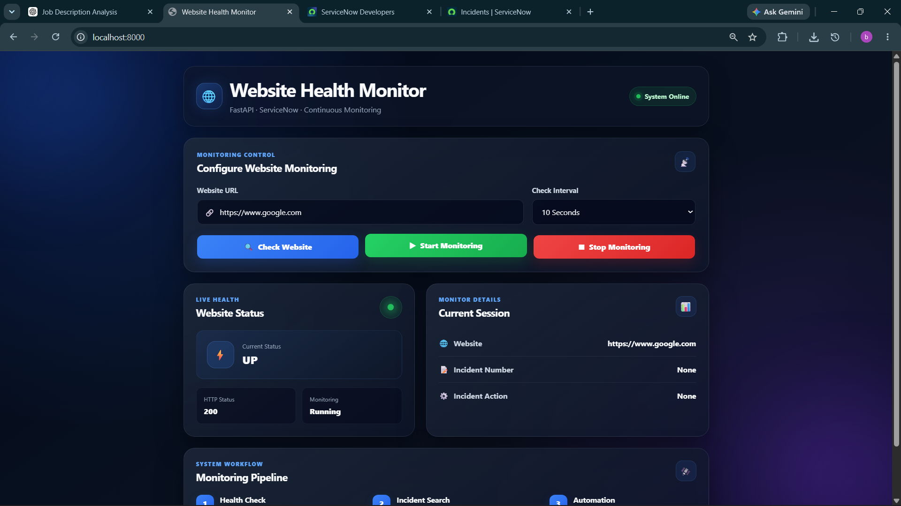
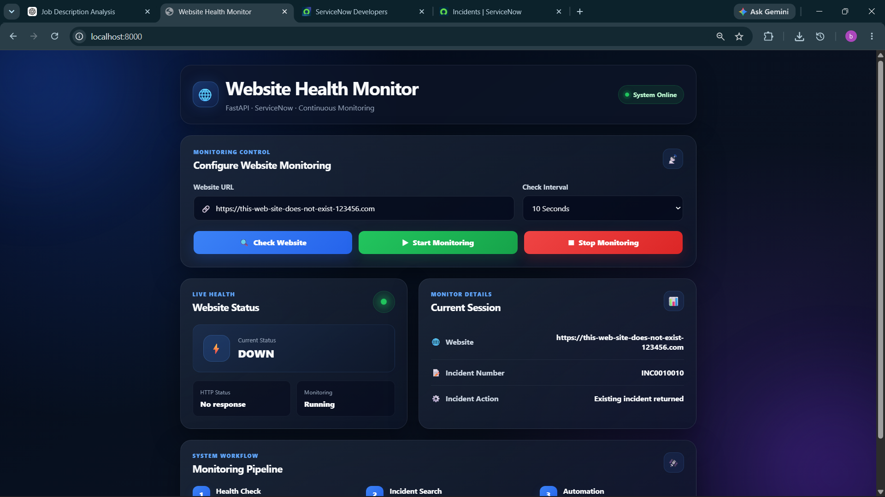
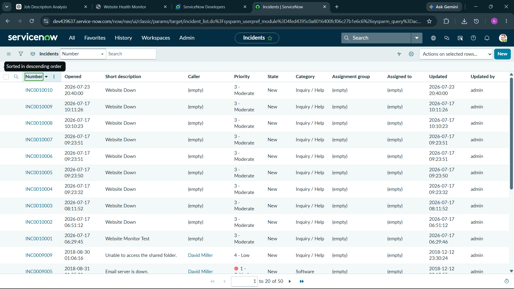
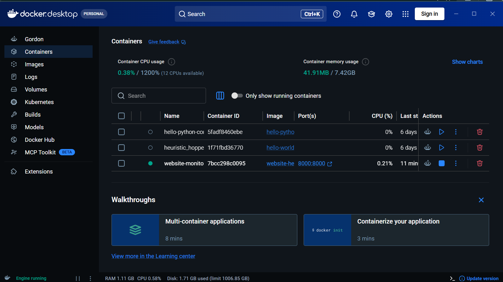

<div align="center">

# 🌐 Website Health Monitor

### Real-time website availability monitoring with automated ServiceNow incident management

[](https://www.python.org/)
[](https://fastapi.tiangolo.com/)
[](https://developer.servicenow.com/)
[](https://www.docker.com/)
[](LICENSE)
[]()

<br/>

> **Monitor any website. Detect outages instantly. Auto-create ServiceNow incidents.**
> A production-style monitoring tool built with FastAPI, a real-time dashboard, and full ITSM integration.

</div>

---

## 📋 Table of Contents

- [✨ Features](#-features)
- [🛠️ Tech Stack](#️-tech-stack)
- [🏗️ Architecture](#️-architecture)
- [📡 API Reference](#-api-reference)
- [🚀 Quick Start](#-quick-start)
- [🐳 Docker Deployment](#-docker-deployment)
- [📸 Screenshots](#-screenshots)
- [🎬 Demo Video](#-demo-video)
- [📁 Project Structure](#-project-structure)
- [🏷️ Resume Bullet Points](#️-resume-bullet-points)
- [🤝 Contributing](#-contributing)
- [📄 License](#-license)

---

## ✨ Features

| Feature | Description |
|---|---|
| 🔍 **Instant Health Check** | One-click HTTP check with status code, latency classification, and error diagnosis |
| 🔄 **Continuous Monitoring** | Background daemon thread polls a URL at configurable intervals (10s → 5min) |
| 🎫 **Incident Deduplication** | Searches ServiceNow for an existing active incident before creating a new one |
| 🚨 **Auto Incident Creation** | Automatically raises P2 incidents in ServiceNow when a site goes DOWN |
| 📊 **Live Dashboard** | Vanilla JS frontend polls `/monitor/status` every 5 seconds — no page refresh needed |
| 🐳 **Docker Ready** | Single `docker run` command gets the full stack running |
| 📝 **Structured Logging** | Timestamped log file with INFO / WARNING / ERROR levels in `logs/monitor.log` |
| ⚡ **Auto Docs** | FastAPI auto-generates interactive Swagger UI at `/docs` |

---

## 🛠️ Tech Stack

### Backend
| Technology | Version | Purpose |
|---|---|---|
| **Python** | 3.11 | Core runtime |
| **FastAPI** | 0.139 | REST API framework with async support |
| **Uvicorn** | 0.51 | ASGI server |
| **Pydantic** | 2.x | Request/response validation and serialization |
| **Requests** | 2.34 | Outbound HTTP health checks |
| **python-dotenv** | 1.2 | Environment variable management |
| **Threading** | stdlib | Daemon thread for continuous monitoring loop |

### Frontend
| Technology | Purpose |
|---|---|
| **HTML5 / CSS3** | Glassmorphism dashboard UI |
| **Vanilla JavaScript** | Async fetch API calls, live polling every 5 seconds |
| **FastAPI StaticFiles** | Serves the frontend directly — no separate web server needed |

### Integrations & Infrastructure
| Technology | Purpose |
|---|---|
| **ServiceNow REST API** | ITSM incident lifecycle — search & create via `/api/now/table/incident` |
| **Docker** | Containerised deployment with a single command |
| **Python Logging** | File-based structured logging to `logs/monitor.log` |

---

## 📡 API Reference

Base URL: `http://localhost:8000`
Interactive docs: `http://localhost:8000/docs`

### Endpoints

| Method | Endpoint | Description | Auth |
|---|---|---|---|
| `GET` | `/` | Serves the web dashboard | None |
| `POST` | `/monitor/check` | Run a single health check | None |
| `POST` | `/monitor/start` | Start continuous background monitoring | None |
| `POST` | `/monitor/stop` | Stop the background monitoring thread | None |
| `GET` | `/monitor/status` | Get current monitoring state & last result | None |

---

### `POST /monitor/check`

Performs an immediate health check and raises/returns a ServiceNow incident if the site is DOWN.

**Request body:**
```json
{
  "url": "https://www.example.com"
}
```

**Response — site UP:**
```json
{
  "status": "UP",
  "status_code": 200,
  "message": "Website is Healthy",
  "incident_number": null,
  "incident_action": null
}
```

**Response — site DOWN (new incident):**
```json
{
  "status": "DOWN",
  "status_code": 503,
  "message": "Server Error (503)",
  "incident_number": "INC0010042",
  "incident_action": "New incident created"
}
```

**Response — site DOWN (existing incident):**
```json
{
  "status": "DOWN",
  "status_code": null,
  "message": "Request Timed Out",
  "incident_number": "INC0010042",
  "incident_action": "Existing incident returned"
}
```

---

### `POST /monitor/start`

Starts a background daemon thread that checks the URL at the given interval.

**Request body:**
```json
{
  "url": "https://www.example.com",
  "interval": 30
}
```

**Response:**
```json
{
  "message": "Monitoring started",
  "url": "https://www.example.com",
  "interval": 30
}
```

**Error (already running):** `400 Bad Request` — `"Monitoring is already running"`

---

### `POST /monitor/stop`

Signals the monitoring thread to stop after its current sleep cycle.

**Response:**
```json
{
  "message": "Monitoring stopped"
}
```

---

### `GET /monitor/status`

Returns the current monitoring state, target URL, interval, and the last health check result.

**Response:**
```json
{
  "running": true,
  "url": "https://www.example.com",
  "interval": 30,
  "last_result": {
    "status": "UP",
    "status_code": 200,
    "message": "Website is Healthy"
  }
}
```


---

## 🏗️ Architecture

### System Flow Diagram

```
┌──────────────────────────────────────────────────────────────────────┐
│                        USER BROWSER                                   │
│                   (Glassmorphism Dashboard)                           │
└─────────────────────────┬────────────────────────────────────────────┘
                           │  HTTP (fetch API)
                           ▼
┌──────────────────────────────────────────────────────────────────────┐
│                      FASTAPI APPLICATION                              │
│                     (app/main.py · port 8000)                        │
│                                                                       │
│   GET  /              → Serves index.html                            │
│   /static/*           → Serves CSS / JS                              │
│   /monitor/*          → APIRouter (app/routers/monitor.py)           │
└─────────┬───────────────────────────────────┬────────────────────────┘
          │                                   │
          ▼                                   ▼
┌─────────────────────┐           ┌───────────────────────────────────┐
│   health_service    │           │        monitoring_service          │
│  check_website(url) │           │  start_monitoring(url, interval)  │
│                     │           │  stop_monitoring()                 │
│  → HTTP GET target  │           │  get_monitoring_status()          │
│  → Classify status  │           │                                   │
│    UP / DOWN /       │           │  Daemon Thread ──────────────────►│
│    UNKNOWN           │           │  (calls health_service in loop)   │
└─────────┬───────────┘           └───────────────┬───────────────────┘
          │                                       │
          └────────────────┬──────────────────────┘
                           │  On DOWN status
                           ▼
┌──────────────────────────────────────────────────────────────────────┐
│                    servicenow_service                                 │
│                                                                       │
│  find_existing_incident(url)  →  GET  /api/now/table/incident        │
│       ↓ None found                                                    │
│  create_incident(desc)        →  POST /api/now/table/incident        │
│                                                                       │
│  Auth: Basic (SERVICENOW_USERNAME : SERVICENOW_PASSWORD)             │
│  Instance: SERVICENOW_INSTANCE (from .env)                           │
└──────────────────────────────────────────────────────────────────────┘
```

### Mermaid Flow Diagram



### Request Lifecycle — Single Health Check

```
POST /monitor/check  {"url": "https://example.com"}
         │
         ├─► health_service.check_website("https://example.com")
         │         │
         │         ├─ requests.get(url, timeout=5)
         │         │       ├─ 200-399  → {"status":"UP",  "status_code":200}
         │         │       ├─ 400-499  → {"status":"DOWN","message":"Client Error"}
         │         │       ├─ 500-599  → {"status":"DOWN","message":"Server Error"}
         │         │       ├─ Timeout  → {"status":"DOWN","message":"Request Timed Out"}
         │         │       └─ ConnErr  → {"status":"DOWN","message":"Connection Failed"}
         │
         └─ (if DOWN) ──► servicenow_service
                               ├─ find_existing_incident → GET ServiceNow API
                               │     └─ found  → return incident_number
                               └─ create_incident → POST ServiceNow API
                                     └─ return new incident_number
```


---

## 📸 Screenshots

### Dashboard — System Online


### Website UP — Healthy Response


### Website DOWN — Incident Triggered


### ServiceNow Incidents Panel


### Docker Running


---

## 🎬 Demo Video

▶ **[Watch the full demo on Google Drive](https://drive.google.com/file/d/190pCN6ECqXZPCJXbAt6J_Lsub9w_eUbq/view?usp=sharing)**

The demo walks through:
1. Starting the FastAPI server (local and Docker)
2. Running a single health check on a live website
3. Simulating a website outage and watching the ServiceNow incident get created automatically
4. Using continuous monitoring with a 30-second interval
5. Verifying the incident deduplication — the same incident is returned on subsequent DOWN checks


---

## 🚀 Quick Start

### Prerequisites

- Python **3.10+**
- A [ServiceNow Developer Instance](https://developer.servicenow.com/) (free)
- Git

### 1 — Clone the repository

```bash
git clone https://github.com/bharathkumar7733/website-health-monitor.git
cd website-health-monitor
```

### 2 — Create and activate a virtual environment

```bash
# Windows
python -m venv venv
venv\Scripts\activate

# macOS / Linux
python -m venv venv
source venv/bin/activate
```

### 3 — Install dependencies

```bash
pip install -r requirements.txt
```

### 4 — Configure environment variables

```bash
cp .env.example .env
```

Open `.env` and fill in your ServiceNow credentials:

```env
SERVICENOW_INSTANCE=https://dev12345.service-now.com
SERVICENOW_USERNAME=admin
SERVICENOW_PASSWORD=your_password
```

### 5 — Run the application

```bash
uvicorn app.main:app --reload
```

Open your browser at **http://localhost:8000** — the dashboard loads immediately.

> Swagger UI is available at **http://localhost:8000/docs**

---

## 🐳 Docker Deployment

No Python installation required — just Docker.

### Build & run

```bash
# Build the image
docker build -t website-health-monitor .

# Run with your .env file mounted
docker run -d \
  --name health-monitor \
  -p 8000:8000 \
  --env-file .env \
  website-health-monitor
```

### Access the app

```
Dashboard  →  http://localhost:8000
API Docs   →  http://localhost:8000/docs
```

### Useful Docker commands

```bash
# View logs
docker logs -f health-monitor

# Stop the container
docker stop health-monitor

# Remove the container
docker rm health-monitor

# Rebuild after code changes
docker build -t website-health-monitor . && docker run -d --name health-monitor -p 8000:8000 --env-file .env website-health-monitor
```

---

## 📁 Project Structure

```
website-health-monitor/
├── app/
│   ├── main.py                   # FastAPI app entry point, static file mounting
│   ├── core/
│   │   └── config.py             # Loads and validates .env variables
│   ├── models/
│   │   └── schemas.py            # Pydantic request/response models
│   ├── routers/
│   │   └── monitor.py            # /monitor/* API endpoints
│   ├── services/
│   │   ├── health_service.py     # HTTP health check logic
│   │   ├── monitoring_service.py # Daemon thread continuous monitoring
│   │   └── servicenow_service.py # ServiceNow REST API integration
│   └── utils/
│       └── logger.py             # Structured file logger
├── frontend/
│   ├── index.html                # Dashboard UI
│   ├── script.js                 # Async API calls, live polling
│   └── style.css                 # Glassmorphism design
├── screenshots/                  # App screenshots for documentation
├── demo video/                   # Local demo recording
├── .env.example                  # Environment variable template
├── .gitignore                    # Excludes venv, .env, logs, __pycache__
├── Dockerfile                    # Container build instructions
├── requirements.txt              # Pinned Python dependencies
├── LICENSE                       # MIT License
└── README.md                     # This file
```


---

## 🏷️ Resume Bullet Points

Ready to copy-paste into your CV, LinkedIn, or portfolio:

---

**Website Health Monitor** | Python · FastAPI · ServiceNow · Docker

- Built a real-time website availability monitoring system using **FastAPI** and **Python**, capable of performing HTTP health checks and classifying responses as UP, DOWN, or UNKNOWN based on HTTP status codes and connection errors.

- Integrated with the **ServiceNow REST API** (Table API) to automatically create P2 incident tickets when a monitored website goes down, and implemented deduplication logic to prevent redundant incidents for the same outage.

- Designed a **continuous monitoring daemon** using Python's `threading` module, allowing background polling at configurable intervals (10s–5min) without blocking the main API thread.

- Developed a **glassmorphism-styled real-time dashboard** in Vanilla JS that polls the `/monitor/status` endpoint every 5 seconds to display live website health status and active incident information.

- Containerised the full application with **Docker**, enabling one-command deployment (`docker run`) with environment variable injection via `--env-file`.

- Applied **clean architecture principles** — separating concerns across routers, services, and models — resulting in a modular, testable codebase following REST API best practices.

---

### 🏷️ Suggested GitHub Repository Topics

Add these topics to your repo via **Settings → Topics** on GitHub:

`python` · `fastapi` · `servicenow` · `monitoring` · `health-check` · `docker` · `itsm` · `incident-management` · `rest-api` · `uvicorn` · `pydantic` · `devops` · `automation` · `dashboard` · `website-monitor`


---

## 🤝 Contributing

Contributions are welcome. Here's how to get started:

```bash
# Fork the repo, then:
git clone https://github.com/YOUR_USERNAME/website-health-monitor.git
cd website-health-monitor

# Windows
python -m venv venv
venv\Scripts\activate

# macOS / Linux
python -m venv venv
source venv/bin/activate

pip install -r requirements.txt
cp .env.example .env   # fill in your ServiceNow credentials
uvicorn app.main:app --reload
```

Please open an issue first for major changes, so we can discuss the approach before you invest time in a pull request.

---

## 📄 License

This project is licensed under the **MIT License** — see the [LICENSE](LICENSE) file for details.

---

<div align="center">

Built with ❤️ by [Bharath Kumar Chappa](https://github.com/bharathkumar7733)

⭐ Star this repo if you found it useful!

</div>
